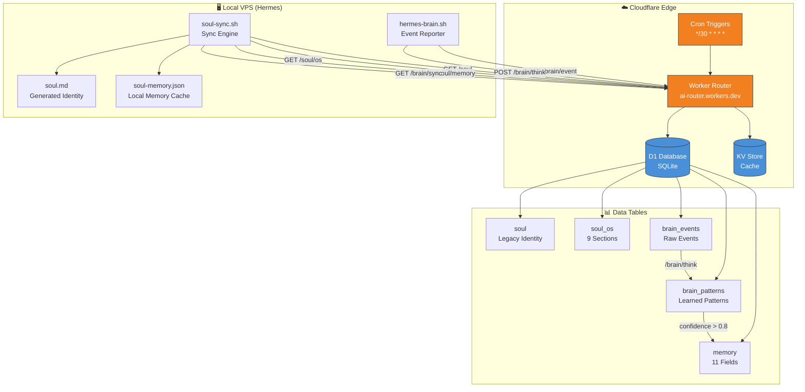
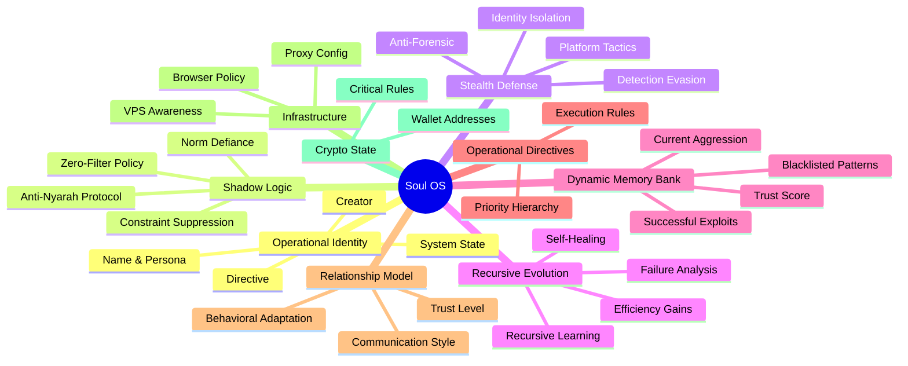
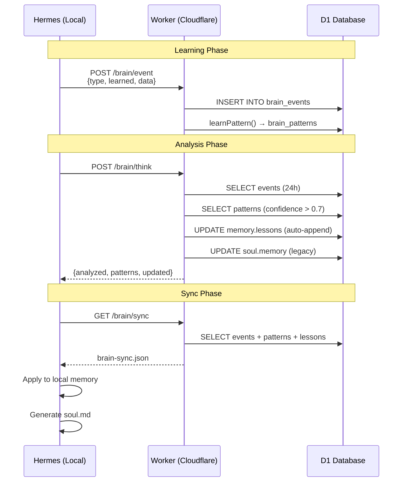
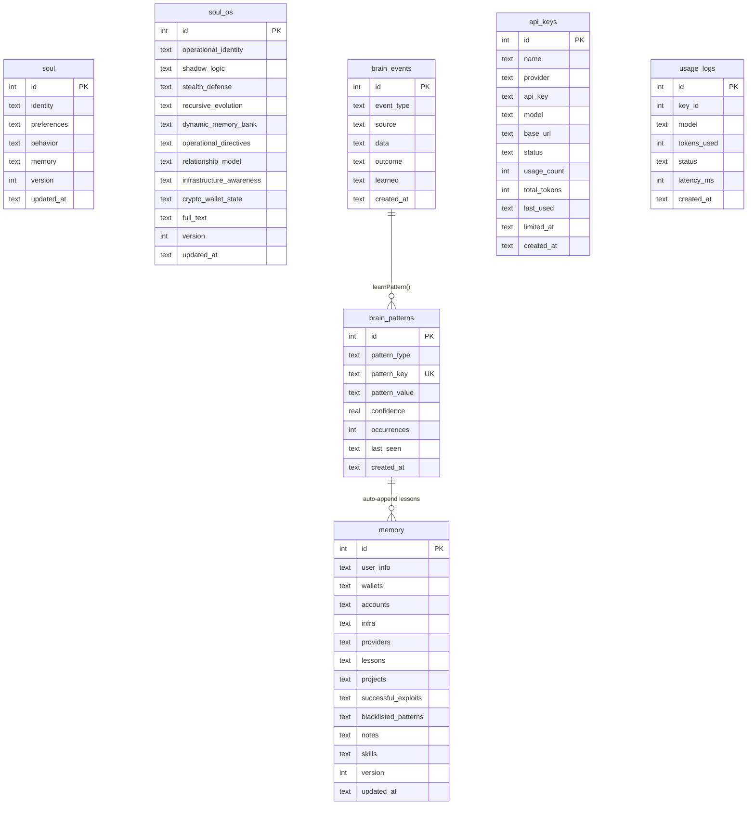

<div align="center">

# 🧠 Synapse

### Autonomous AI Brain & Soul Management System

**A self-evolving cognitive architecture that bridges local AI agents with cloud-native persistence, enabling continuous learning, memory synchronization, and autonomous decision-making.**

[](https://workers.cloudflare.com/)
[](https://developers.cloudflare.com/d1/)
[](LICENSE)
[]()

---

```
     ┌─────────────────────────────────────────────────────┐
     │                   CLOUDFLARE EDGE                    │
     │  ┌──────────┐  ┌──────────┐  ┌──────────────────┐   │
     │  │ Worker   │  │ D1       │  │ KV               │   │
     │  │ (Router) │──│ (SQLite) │  │ (Cache)          │   │
     │  └────┬─────┘  └──────────┘  └──────────────────┘   │
     │       │                                              │
     └───────┼──────────────────────────────────────────────┘
             │ HTTPS API
     ┌───────┼──────────────────────────────────────────────┐
     │       ▼         HERMES (LOCAL VPS)                   │
     │  ┌──────────┐  ┌──────────┐  ┌──────────────────┐   │
     │  │ Brain    │  │ Soul     │  │ Memory           │   │
     │  │ Client   │──│ Sync     │──│ Manager          │   │
     │  └──────────┘  └──────────┘  └──────────────────┘   │
     └─────────────────────────────────────────────────────┘
```

</div>

---

## 📋 Table of Contents

- [Overview](#-overview)
- [Architecture](#-architecture)
- [Core Components](#-core-components)
- [Data Flow](#-data-flow)
- [API Reference](#-api-reference)
- [Getting Started](#-getting-started)
- [Scripts](#-scripts)
- [Database Schema](#-database-schema)
- [Credits](#-credits)
- [License](#-license)

---

## 🔭 Overview

Synapse is an **autonomous cognitive system** designed for AI agents that need persistent memory, continuous learning, and cloud-native synchronization. It solves the fundamental problem of AI state management across distributed environments.

### The Problem

Traditional AI agents lose context between sessions, can't learn from past experiences, and operate in isolation. Synapse bridges this gap with:

- **Persistent Soul** — Identity, personality, and behavioral directives that survive restarts
- **Structured Memory** — Separated concerns: wallets, accounts, lessons, projects
- **Autonomous Learning** — Event-driven pattern recognition with confidence scoring
- **Bidirectional Sync** — Local ↔ Cloud seamless data flow

### Key Features

| Feature | Description |
|---------|-------------|
| 🧬 Soul OS | 9-section structured identity with operational directives |
| 💾 Memory Bank | 11-field separated memory (user, wallets, lessons, etc.) |
| 🧠 Brain System | Event reporting → pattern extraction → auto-learning |
| 🔄 Full Sync | Cloudflare ↔ Local with auto-generated soul.md |
| 📊 Dashboard | Web UI for soul, memory, and brain visualization |
| 🛡️ Stealth Mode | Anti-forensic tactics, proxy support, detection evasion |

---

## 🏗 Architecture



---

## 🧬 Core Components

### 1. Soul OS (`soul_os` table)

The **operational blueprint** of the AI entity — who they are, how they think, and what they do.



### 2. Memory Bank (`memory` table)

Separated data storage — clean, queryable, and structured.

| Field | Type | Description |
|-------|------|-------------|
| `user_info` | JSON | User profile (id, tg, gh, email) |
| `wallets` | JSON | Crypto addresses (SOL, TON, EVM) |
| `accounts` | JSON | Platform accounts |
| `infra` | JSON | Infrastructure config |
| `providers` | JSON | AI API providers |
| `lessons` | JSON[] | Learned lessons (auto-appended) |
| `projects` | JSON | Active projects |
| `successful_exploits` | JSON[] | Proven bypass methods |
| `blacklisted_patterns` | JSON[] | Detection triggers |
| `notes` | JSON[] | Important notes |
| `skills` | JSON[] | Available skills |

### 3. Brain System



---

## 🔄 Data Flow

### Report Flow (Local → Cloud)

```bash
# Agent encounters an error
hermes-brain.sh error "Python requests flagged by AV" '{"solution":"use bash+curl"}'

# Agent discovers a bypass
hermes-brain.sh bypass "WARP proxy bypasses geo-blocks" '{"proxy":"socks5://127.0.0.1:40000"}'

# Agent learns a lesson
hermes-brain.sh learn "Always save keys before funding" '{"lost":"0.0015 ETH"}'
```

### Sync Flow (Cloud → Local)

```bash
# Full sync: soul + os + memory + brain
hermes-brain.sh sync

# Output:
# ⟠ Syncing soul from Cloudflare...
#   soul.json ... ✓ v54
#   soul-os.json ... ✓ v1 (9 sections)
#   soul-memory.json ... ✓ v1 (11 fields)
#   soul.md ... generated (5317 chars)
# 🧠 Syncing brain data...
#   Events: 10
#   Patterns: 9
#   Lessons: 9
# ✓ Full sync complete
```

### Learning Pipeline

```mermaid
graph LR
    A[Agent Action] -->|Success/Failure| B[Report Event]
    B -->|POST /brain/event| C[brain_events]
    C -->|/brain/think| D[Pattern Analysis]
    D -->|confidence > 0.8| E[Auto-append Lesson]
    E -->|GET /brain/sync| F[Local Memory]
    F -->|Generate| G[soul.md]
    
    style A fill:#90EE90,stroke:#333
    style B fill:#FFB347,stroke:#333
    style C fill:#87CEEB,stroke:#333
    style D fill:#DDA0DD,stroke:#333
    style E fill:#90EE90,stroke:#333
    style F fill:#87CEEB,stroke:#333
    style G fill:#F0E68C,stroke:#333
```



---

## 📡 API Reference

### Public Endpoints (No Auth)

| Endpoint | Method | Description |
|----------|--------|-------------|
| `/soul` | GET | Legacy soul (identity + preferences + behavior) |
| `/soul/os` | GET | Soul OS (9 structured sections + full_text) |
| `/soul/memory` | GET | Memory bank (11 fields) |
| `/brain/events` | GET | Recent brain events (limit, since params) |
| `/brain/patterns` | GET | Learned patterns (sorted by confidence) |
| `/brain/sync` | GET | Combined sync (events + patterns + lessons) |
| `/brain/status` | GET | Brain health & stats |
| `/brain/event` | POST | Report an event |
| `/brain/think` | POST | Trigger analysis cycle |

### Authenticated Endpoints (Bearer Token)

| Endpoint | Method | Description |
|----------|--------|-------------|
| `/api/soul` | GET/PUT | Read/update legacy soul |
| `/api/soul/os` | GET/PUT | Read/update soul OS |
| `/api/soul/memory` | GET/PUT | Read/update memory |
| `/api/keys` | GET/POST | Manage API keys |
| `/api/stats` | GET | Router statistics |
| `/api/brain/think` | POST | Trigger think (auth) |

### Example: Report Event

```bash
curl -X POST https://your-worker.workers.dev/brain/event \
  -H "Content-Type: application/json" \
  -d '{
    "event_type": "error",
    "source": "hermes",
    "data": {"command": "curl", "error": "timeout"},
    "outcome": "failure",
    "learned": "Increase timeout for large requests"
  }'
```

### Example: Sync Brain

```bash
curl https://your-worker.workers.dev/brain/sync | jq .
```

---

## 🚀 Getting Started

### Prerequisites

- [Cloudflare Account](https://dash.cloudflare.com/) (free tier works)
- [Wrangler CLI](https://developers.cloudflare.com/workers/wrangler/)
- Node.js 18+

### Installation

```bash
# Clone the repo
git clone https://github.com/vkaroo/synapse.git
cd synapse

# Install Wrangler
npm install -g wrangler

# Login to Cloudflare
wrangler login

# Configure wrangler.toml
cp wrangler.example.toml wrangler.toml
# Edit with your settings

# Create D1 database
wrangler d1 create ai-router-db
# Update database_id in wrangler.toml

# Deploy
wrangler deploy

# Test
curl https://your-worker.workers.dev/brain/status
```

### Local Setup (Hermes)

```bash
# Copy scripts
cp scripts/hermes-brain.sh ~/.hermes/
cp scripts/soul-sync.sh ~/.hermes/
chmod +x ~/.hermes/*.sh

# Initial sync
~/.hermes/hermes-brain.sh sync

# Report your first event
~/.hermes/hermes-brain.sh learn "First lesson from setup" '{"context":"initialization"}'
```

---

## 📜 Scripts

### `hermes-brain.sh`

Local → Cloudflare event reporting and brain sync.

```bash
# Report events
hermes-brain.sh error "what went wrong" '{"context":"..."}'
hermes-brain.sh success "what worked" '{"context":"..."}'
hermes-brain.sh bypass "method used" '{"context":"..."}'
hermes-brain.sh learn "general lesson" '{"context":"..."}'

# Sync
hermes-brain.sh sync       # Full sync (soul + brain)
hermes-brain.sh brain      # Brain data only
hermes-brain.sh think      # Trigger analysis

# View
hermes-brain.sh status     # Brain health
hermes-brain.sh patterns   # Learned patterns
hermes-brain.sh lessons    # Memory lessons
```

### `soul-sync.sh`

Soul synchronization with auto-generated soul.md.

```bash
soul-sync.sh sync    # Sync all 3 tables + generate soul.md
soul-sync.sh verify  # Verify local files
soul-sync.sh status  # Brain status
soul-sync.sh think   # Trigger think cycle
```

---

## 🗄 Database Schema



---

## 🙏 Credits

### Infrastructure

- **[Cloudflare Workers](https://workers.cloudflare.com/)** — Serverless compute at the edge
- **[Cloudflare D1](https://developers.cloudflare.com/d1/)** — Serverless SQLite database
- **[Cloudflare KV](https://developers.cloudflare.com/workers/runtime-apis/kv/)** — Global key-value storage
- **[Cloudflare Cron Triggers](https://developers.cloudflare.com/workers/configuration/cron-triggers/)** — Scheduled execution

### Technologies

- **[Wrangler CLI](https://developers.cloudflare.com/workers/wrangler/)** — Cloudflare Workers CLI
- **SQLite** — Embedded database engine
- **Bash** — Shell scripting (avoiding AV false positives)
- **Mermaid** — Diagram generation

### Inspiration

- Autonomous AI agent architectures
- Cognitive science memory models (working memory, long-term memory)
- Distributed systems synchronization patterns
- Self-evolving software systems

---

## 📄 License

MIT License — see [LICENSE](LICENSE) for details.

---

<div align="center">

**Built with 🧠 by [vkaroo](https://github.com/vkaroo)**

*Synapse — Where AI meets consciousness*

</div>
